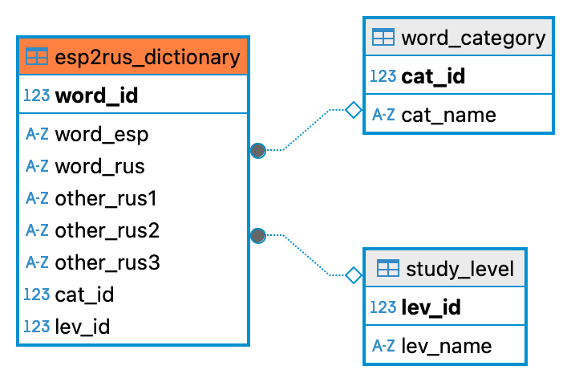

# 🇪🇸 Esp2Ru_bot — Telegram-бот для изучения испанского

## Общее описание проекта

**Наименование бота**: @Esp2Rus_bot  
**Цель**: Образовательный Telegram-бот для тренировки перевода испанских слов на русский язык с помощью интерактивных викторин.  
**Референс**: @InMindBot  

**MVP функциональность**:
- Выбор категории и уровня сложности
- Викторина с вариантами ответов
- Подсчёт результатов и повтор

---

## Администрирование

- Загрузка CSV-файлов прямо в Telegram
- Добавление и удаление категорий и уровней
- Просмотр статистики по категориям и уровням

### 🔁 Загрузка CSV

1. Админ отправляет `.csv` файл в чат с ботом
2. Файл конвертируется → `words.json`
3. Происходит импорт в базу данных
4. Бот отвечает: сколько добавлено / пропущено / ошибок

### Структура CSV файла:
- `word_esp` — слово на испанском (одно слово)  
- `word_rus` — корректный перевод (одно слово)  
- `other_rus` — три альтернативных перевода, разделённых запятыми, без пробелов  
- `category` — категория слова (на русском языке, выбор из предопределённого списка)  
- `level` — уровень сложности: начальный, средний, продвинутый

**Пример категорий**: Животные, Овощи и фрукты, Одежда, Глаголы действия, Профессии, Транспорт, Эмоции, Природа, Дом и быт, Части тела.

**Пример JSON:**
```json
[
  {
    "word_esp": "perro",
    "word_rus": "собака", 
    "other_rus": "кошка,птица,лошадь", 
    "category": "Животные", 
    "level": "начальный"
  },
  {
    "word_esp": "camisa",
    "word_rus": "рубашка",
    "other_rus": "брюки,юбка,пальто",
    "category": "Одежда", 
    "level": "средний"
  }
]
```
**Важно:** 

✅ в БД добавляются только уникальные испанские слова `word_esp` (без учёта регистра). Если слово уже присутствует — оно будет проигнорировано. Проверка корректности перевода на данном этапе не производится.
✅ Категории и уровни также уникальны без учёта регистра

---

## Взаимодействие с пользователем

1. Пользователь запускает бота командой `/start`
2. Бот предлагает выбрать (доступен ОДИН выбор):
   - категорию
   - уровень сложности или "все уровни"
   - количество слов для теста
3. Слова выбираются случайно из базы по фильтрам
4. Для каждого слова:
   - Показывается слово на испанском
   - Предлагаются 4 варианта на русском (рандомный порядок)
   - Бот реагирует на ответ (✅/❌)
5. В конце — % правильных ответов

**Ограничения MVP**:
- нет сохранения истории пользователя
- нет рейтингов
- повторный запуск с выбором параметров

---

## Структура базы данных

### Таблица #1: esp2rus_dictionary
- word_id (PK, serial)
- word_esp (text)
- word_rus (text)
- other_rus1, other_rus2, other_rus3 (text)
- cat_id (FK → word_category)
- lev_id (FK → study_level)

### Таблица #2: word_category
- cat_id (PK)
- cat_name (text)

### Таблица #3: study_Level
- lev_id (PK)
- lev_name (text) — «начальный», «средний», «продвинутый»

#### 📦 Структура базы данных (SQL)

##### 

##### [📄 SQL-скрипт для создания таблиц БД](db/schema.sql)


### Таблица #4: client_db (на перспективу)
- id (PK)
- client_id (integer)
- client_tgnick (text)
- date_reg (date)
- date_last_login (date)
- correct_words (array of word_id)
- client_rating (integer) — общее число правильных ответов (необходимо уточнить расчёт, включив в него LTV)

---

## Дополнительно

В будущем можно добавить:
- сохранение прогресса
- повторение сложных слов
- устойчивые выражения
- озвучка и аудио-викторины
- Telegram Login
- напоминания

---
## Минимальный стек технологий

- **Язык**: Python 3.11+
- **Фреймворк для бота**: aiogram (v3+)
- **СУБД**: PostgreSQL (через DBeaver)
- **ORM / драйвер БД**: SQLAlchemy
- **Хранилище JSON**: вручную через Telegram
- **Управление конфигурацией**: .env + dotenv
- **Логика FSM**: встроенная в aiogram FSMContext
- **Инфраструктура и деплой**: Docker + Docker Compose, VPS (Selectel)

---

## 8. Структура проекта

```
esp2rus_bot/
├── bot/
│   ├── __init__.py
│   ├── handlers/                 
│   │   ├── __init__.py
│   │   ├── user_handlers.py      # Логика викторины: обработка команд /start, /help и логика для пользователей
│   │   └── admin_handlers.py     # Админ панель: загрузка CSV-файлов, добавление и удаление категорий и уровней
│   ├── keyboards.py              # клавиатуры Telegram
│
├── core/
│   ├── __init__.py
│   ├── config.py                 # Конфиги: токен, список админов, пути
│   ├── utils.py                  # Вспомогательные функции: валидация, рандомизация
│   └── converter.py              # CSV → JSON (сохраняет words.json)
│
├── db/
│   ├── __init__.py
│   ├── models.py                 # SQLAlchemy-модели
│   ├── schema.sql/png            # SQL-структура БД / схема БД
│   └── importer.py               # Импорт JSON в БД
│
├── data/
│   ├── uploads/                  # Папка для загрузки CSV-файлов (отправленных админом через бота в Telegram)
│   ├── words.json                # Итоговый JSON-файл после разбора CSV
│
├── scripts/
│   └── stats.sql                 # Готовые SQL-скрипты для подсчет аналитики в разных разрезах
│
│── .gitignore                    # Исключение виртуального окружения
├── .env                          # ТГ Токен и учетные данные для подключения к БД 
├── .env.example                  # шаблон окружения
├── docker-compose.yml
├── Dockerfile
├── requirements.txt             # Зависимости проекта
├── README.md                    # Текущий документ
├── main.py                      # Точка входа: регистрация хендлеров, запуск бота

```
## ⚙️ Установка

1. **Клонируй проект**
```bash
git clone https://github.com/your-username/Esp2Ru_bot.git
cd Esp2Ru_bot
```

2. **Создай .env файл**
```bash
cp .env.example .env
```
Заполни переменные: `BOT_TOKEN`, `DB_PASSWORD`, `ADMIN_IDS`

3. **Запусти Docker**
```bash
docker compose up -d --build
```

4. **Готово! Бот запущен.**

#### ⚠️ Подробные инструкции по запуску проекта можно найти [здесь](DOCs/deploy.md)

## 🧪 Команды

- `/start` — начать викторину
- `/cancel` — отменить текущую сессию (возврат к `/start`)
- `/admin` — вход в админ-панель

## 🔧 Админ-панель `/admin`

Команда `/admin` доступна только администраторам (из списка `ADMIN_IDS`).  
Открывает визуальное меню управления словарём и базой данных прямо в Telegram:

| Кнопка                                         | Описание                                                                |
|------------------------------------------------|-------------------------------------------------------------------------|
| 📊 **Статистика по категориям**                | Показывает количество слов в каждой категории                           |
| 📈 **Статистика по урповням** | Выводит количество слов всех уровней |
| ➕ **Добавить категорию**                       | Позволяет ввести новую категорию (в нижнем регистре)                    |
| 🗑 **Удалить категорию**                       | Удаляет категорию и все слова, связанные с ней                          |
| ➕ **Добавить уровень**                         | Добавляет новый уровень сложности (например: *начальный*)               |
| 🗑 **Удалить уровень**                         | Удаляет уровень и все слова, связанные с ним                            |

После каждого действия бот возвращает пользователя в меню.


# 🚀 Roadmap проекта Esp2Rus_bot

## 📦 MVP

- [x] Импорт CSV → JSON
- [x] FSM: выбор категории, уровня, количества слов
- [x] Викторина: вопросы, варианты, пропуск, ответы
- [x] Завершение викторины: подсчёт % и вывод
- [x] Финальное UX-тестирование и отладка
- [x] Продакшн-деплой (VPS + PostgreSQL)

---

## 🔧 Улучшения (v1.x)

- [ ] Команда /help и /about
- [ ] Подсчёт количества «пропущено»
- [ ] Статистика пользователя (в будущем — Client DB)
- [ ] Telegram Login для авторизации
- [ ] Озвучка слов / аудиовикторина

---

## 🛠 Администрирование

- [x] Загрузка CSV-файла прямо в чат
- [x] Конвертация в JSON
- [x] Импорт в БД
- [ ] Веб-интерфейс администратора (v2.x)

---

## 🌐 Будущее (v2.x)

- [ ] Личный кабинет (на Flask или FastAPI)
- [ ] Рассылка новых слов / слов дня
- [ ] Интеграция с Google Sheets

### Следите за обновлениями

## 📩 Обратная связь приветсвуется

Создатель: [@nikolay_mazur](https://t.me/nikolay_mazur)

### 🙏 Спасибо за внимание!

echo ""