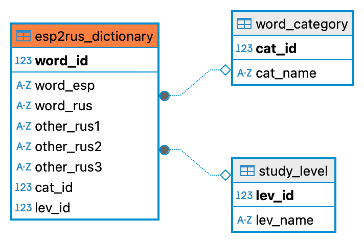

# 🇪🇸 Esp2Ru_bot — Telegram-бот для изучения испанского

## Общее описание проекта

**Наименование бота**: [@Esp2Rus_bot](https://t.me/Esp2Ru_bot)  
**Цель**: Образовательный Telegram-бот для тренировки перевода испанских слов на русский язык с помощью интерактивных викторин.  
**Референс**: @InMindBot  

---

**⚙️ MVP функциональность**:
- Выбор категории слов и уровня сложности 
- Интерактивная викторина с подсчётом правильных ответов 
- Загрузка слов в базу данных через Telegram (CSV)
- Административная панель внутри бота (/admin)
- Автоматический деплой через GitHub Actions на сервер

---

## Структура базы данных

#### [Описание целевой архитектуры БД проекта](docs/archeved/db_structure.md)

##### 

##### [📄 SQL-скрипт для создания таблиц БД (этап MVP)](db/create/archive/schema_legacy.sql)

---
## 🛠 Стек технологий

- **Язык**: Python 3.11+
- **Фреймворк для бота**: aiogram (v3+)
- **СУБД**: PostgreSQL (через DBeaver)
- **ORM / драйвер БД**: SQLAlchemy
- **Хранилище JSON/CSV**: вручную через Telegram
- **Управление конфигурацией**: .env + dotenv
- **Логика FSM**: встроенная в aiogram FSMContext
- **Инфраструктура и деплой**: Docker + Docker Compose, VPS (Selectel)
- **CI/CD**: GitHub Actions (автоматический деплой)

---

## 📦 Структура проекта

```
Esp2Ru_bot/
├── bot/                # Хендлеры пользователей и админов
├── core/               # Конфигурация, утилиты
├── db/                 # Модели базы данных и импорт слов
├── data/               # Логи, загруженные CSV/JSON файлы
├── scripts/            # Скрипты для аналитики
├── .github/workflows/  # CI/CD пайплайны
├── DOCs/               # Подробная документация проекта
├── main.py             # Точка входа
├── docker-compose.yml  # Сборка через Docker
├── Dockerfile          # Билд образа
├── README.md           # Основной документ
├── archived/           # Архив проекта
```

## 📜 [Основная документация проекта](docs/README.md)

#### 📚 [Детальная структура проекта](docs/archeved/project_structure.md)
#### 🧪 [Документация по меню и админ-панели](docs/archeved/admin_panel.md)
#### ⚠️ [Подробные инструкции по автодеплою проекта](docs/archeved/deploy.md)
#### 🚀 [Roadmap проекта](docs/archeved/roadmap.md)
#### 🔧 [Исправленные баги](docs/archeved/bugs.md)


### 📩 Обратная связь: [@nikolay_mazur](https://t.me/nikolay_mazur)